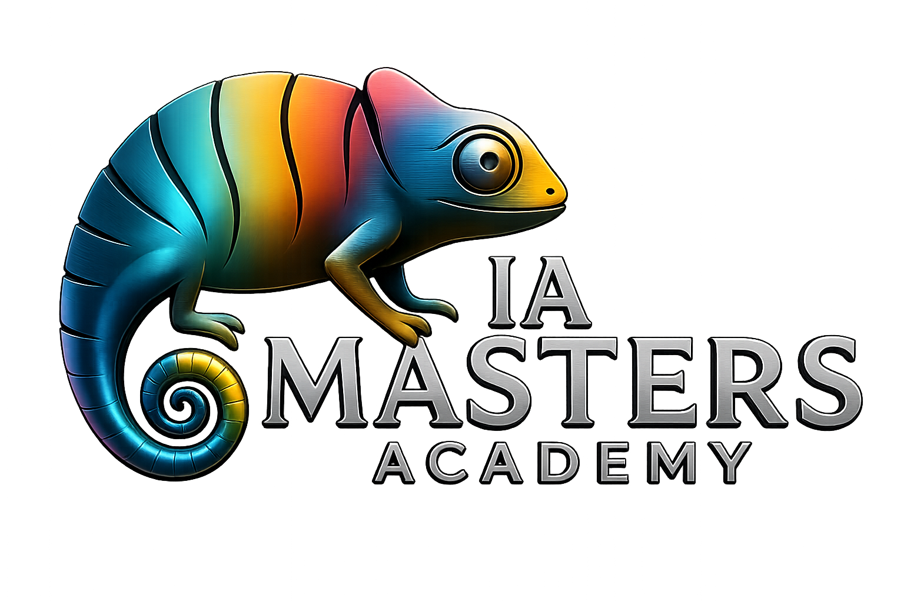

<p align="center">
  
</p>

<h1 align="center">Marketing Agéntico</h1>

<p align="center">
  <strong>Ocho agentes de marketing que trabajan con TU negocio, no con ejemplos de folleto.</strong><br>
  Un kit de skills para Claude · por <a href="https://www.instagram.com/angelapa_ia/">Ángel Aparicio</a> · IA Masters Academy
</p>

<p align="center">
  <a href="#instalación-en-3-minutos">Instalación</a> ·
  <a href="#las-nueve-skills">Las skills</a> ·
  <a href="#preguntas-frecuentes">Dudas</a>
</p>

---

## Qué es esto

La mayoría de la formación en IA te enseña prompts. Un prompt te sirve una vez y se te olvida dónde lo guardaste.

Esto es distinto: son **skills**. Le enseñas a Claude a hacer una tarea de marketing **una sola vez**, y a partir de ahí la sabe hacer siempre, con el método completo detrás. No copias un texto: instalas una capacidad.

Y lo importante: **estas skills no vienen rellenas con el negocio de nadie**. Vienen vacías a propósito. La primera skill del kit te entrevista sobre tu marca, y las otras ocho leen ese perfil. Dos personas con este mismo kit obtienen resultados completamente distintos, porque el método se comparte y el negocio lo pones tú.

> **Regla de oro del kit:** el método es de todos, el negocio es tuyo.

---

## Instalación

### La vía rápida: que lo instale Claude por ti

Si usas **Claude Code** o **Cowork**, no hagas nada a mano. Copia esta dirección:

```
https://github.com/iamasters-academy/marketing-agentico
```

Pégasela a Claude y dile:

> **«Instálame todas las skills de este repositorio»**

Claude lee el fichero [INSTALAR.md](INSTALAR.md), las coloca en su sitio y te dice cuáles han
quedado listas. Cuando termines, reinicia y ya puedes llamarlas escribiendo **`/mi-marca`**,
**`/el-hueco`** y las demás.

Para **actualizarlas** más adelante, mismo gesto: le pasas la dirección y le dices que las
ponga al día. Este campo cambia rápido y el kit se corrige; no te quedes con la versión del
primer día.

> **¿Estás en Claude.ai (web o app)?** Ahí Claude no puede instalar nada por su cuenta: la
> subida es manual. Sigue la vía A de abajo, que son cinco minutos.

---

### Vía A — Claude.ai (sin instalar nada)

Funciona en la web y en la app de escritorio. No necesitas terminal ni saber programar.

**Paso 1 · Activa las skills en tu cuenta.** Entra en [claude.ai](https://claude.ai) → tu nombre (abajo a la izquierda) → **Ajustes** → **Capacidades**, y activa **"Ejecución de código y creación de archivos"**. Sin esto, la opción de skills no aparece. Es el paso que más gente se salta.

**Paso 2 · Descarga la skill ya empaquetada.** No tienes que comprimir nada: en [`instalar/zip/`](instalar/zip/) están las nueve listas, una por archivo. Empieza por **`mi-marca.zip`**.

<details>
<summary>¿Prefieres prepararlo tú a mano? (no hace falta)</summary>

Descarga el repo entero (botón verde **`Code`** → **`Download ZIP`**), descomprímelo, y comprime **la carpeta** de la skill que quieras. El .zip tiene que contener la carpeta entera, no los archivos sueltos de dentro:

```
mi-marca.zip
└── mi-marca/          ← la carpeta, no su contenido
    ├── SKILL.md
    └── references/
```

- **En Mac:** clic derecho sobre la carpeta → *Comprimir "mi-marca"*.
- **En Windows:** clic derecho sobre la carpeta → *Enviar a* → *Carpeta comprimida*.

Si comprimes los archivos de dentro en lugar de la carpeta, la subida da error. Es el fallo más común.
</details>

**Paso 3 · Súbela.** En Claude.ai: **Personalizar** → **Skills** → **`+`** → **Crear skill** → **Subir**, y arrastra el .zip. Ojo, que esto no está en Ajustes: en Ajustes activas la capacidad, en Personalizar subes la skill.

**Paso 4 · Úsala.** Repite los pasos 2 y 3 con cada skill que quieras (van de una en una). Después abre un chat nuevo y **pídelo con palabras normales**:

> «Quiero configurar mi perfil de marca»

**Ojo con esto, que es donde se atasca todo el mundo:** en Claude.ai **no se escriben comandos con barra**. Las skills se activan solas cuando lo que pides encaja con lo que saben hacer. Si ves que no la coge, nómbrala directamente:

> «Usa la skill mi-marca»

> **¿No encuentras alguna opción?** La interfaz de Claude cambia cada pocos meses. Los dos sitios donde mirar son siempre **Ajustes** (para activar la capacidad) y **Personalizar** (para subir la skill).

### Vía B — Claude Code o Cowork, a mano

Si prefieres no pedírselo a Claude y hacerlo tú:

```bash
git clone https://github.com/iamasters-academy/marketing-agentico.git
cp -R marketing-agentico/skills/* ~/.claude/skills/
```

Reinicia y ya las tienes como comandos: `/mi-marca`, `/el-hueco`, `/cliente-vivo`…

También tienes cada skill empaquetada suelta en [`instalar/`](instalar/) (archivos `.skill`), por si quieres instalar solo una.

---

## ¿Con barra o sin barra?

Depende de dónde estés, y es la duda número uno:

| Dónde | Cómo se llama |
|---|---|
| **Claude Code** | `/mi-marca` ✅ |
| **Cowork** | `/mi-marca` ✅ |
| **Claude.ai** (web y app) | Con palabras: *«quiero configurar mi perfil de marca»* o *«usa la skill mi-marca»* |

Los nombres con barra que verás en esta página son la forma de referirnos a cada skill. Si estás en Claude.ai y escribes la barra, no pasará nada: háblale.

---

## Empieza por aquí

**Antes de nada, ejecuta `/mi-marca`.** Es una entrevista de 5 minutos sobre tu negocio: qué vendes, a quién, con qué tono, quiénes son tus competidores. Guarda tu perfil y **las otras ocho skills lo leen automáticamente**.

Si te saltas este paso, las demás skills te van a preguntar lo mismo una y otra vez. Cinco minutos ahora te ahorran cuarenta después.

---

## Las nueve skills

| Skill | Qué hace por ti | Módulo |
|---|---|---|
| **`/mi-marca`** | Te entrevista una vez y crea tu perfil. **Empieza siempre por aquí.** | Puesta a punto |
| **`/el-hueco`** | Lanza varios agentes a la vez a auditar a tus competidores y encuentra el hueco entre lo que prometen y lo que sus clientes se quejan. Sale con tres ángulos de posicionamiento que ellos no pueden copiar. | Business & Growth |
| **`/cliente-vivo`** | Construye un cliente con el que puedes hablar, hecho con reseñas y conversaciones reales, no imaginado. Y te avisa cuando te está diciendo lo que quieres oír. | Customer Intelligence |
| **`/abogado-del-diablo`** | Ataca tu propuesta de valor antes de que lo haga el mercado: por qué no te creo, con qué te comparo, qué objeción me frena. | Posicionamiento |
| **`/analista-lunes`** | Mira tus datos y te dice las tres cosas que han cambiado y por qué. No hace gráficos: te da hipótesis de causa. | Funnel & Analytics |
| **`/mi-voz`** | Aprende a escribir como tú a partir de tus mejores piezas, y luego produce contenido nativo por canal. Con un crítico que rechaza lo que suena a IA. | Generación de Demanda |
| **`/de-cero-a-lead`** | Landing, captura, CRM y email de bienvenida. El circuito entero, funcionando. | Leads |
| **`/me-recomienda-la-ia`** | Mide cuántas veces te nombran ChatGPT, Perplexity y Gemini frente a tu competencia, y te da el plan para que empiecen a hacerlo. | GEO & SEO |
| **`/email-que-piensa`** | Un agente de nurturing que decide qué hacer con cada lead. Incluido no escribirle. | Email & CRM |

Cada skill trae **datos de ejemplo dentro**. Puedes probarlas hoy mismo aunque no tengas Google Analytics, ni CRM, ni una lista de correo.

---

## El test de la mentira

Todas las skills de este kit terminan igual: diciéndote **cómo comprobar que no te han mentido**.

No es un detalle simpático. De los motivos por los que los proyectos de IA se quedan en el cajón, el que más se repite no es que los modelos sean malos: es que los equipos juzgan si una respuesta *suena* bien en lugar de comprobar si *es* correcta. Si te acostumbras a verificar desde el primer día, vas por delante de la mayoría de equipos de marketing que hay ahí fuera.

Cuando una skill te dé un resultado, busca el bloque **🔍 Test de la mentira**. Cada test dice también **qué es lo que no comprueba**, porque ninguna verificación rápida lo cubre todo y venderte lo contrario sería justo lo que este kit intenta evitar.

---

## Preguntas frecuentes

<details>
<summary><strong>¿Necesito saber programar?</strong></summary>

No. Ni una línea. Si sabes escribir un email, sabes usar esto.
</details>

<details>
<summary><strong>¿Necesito pagar algo?</strong></summary>

El kit es gratis. Claude tiene plan gratuito, aunque para trabajar de verdad con varias skills te vas a quedar corto de mensajes. Todas las skills funcionan igual en el plan gratuito, solo que llegarás antes al límite diario.
</details>

<details>
<summary><strong>¿Mis datos van a algún sitio?</strong></summary>

Seamos precisos: lo que escribas se lo estás contando a Claude, como en cualquier conversación con él, y se rige por la política de privacidad de Anthropic. Lo que **estas skills** no hacen es mandar nada a ningún sitio *adicional*: no hay servidor mío ni de nadie por el medio. Son instrucciones en texto plano, puedes abrirlas y leerlas enteras. De hecho, ábrelas: entender qué hay dentro es media clase.
</details>

<details>
<summary><strong>Una skill me ha dado un resultado raro.</strong></summary>

Normal, y es parte del aprendizaje. Primero pasa el test de la mentira. Si el fallo persiste, [abre un issue](https://github.com/iamasters-academy/marketing-agentico/issues) contando qué pediste y qué te devolvió.
</details>

<details>
<summary><strong>¿Puedo modificarlas?</strong></summary>

Debes. Son archivos de texto: ábrelos, cámbialos, rómpelos. La skill que acabe funcionándote va a ser la que tú retoques, no la que yo escribí.
</details>

---

## Licencia y autoría

Kit **Marketing Agéntico**, creado por **Ángel Aparicio** para **IA Masters Academy**.

Uso libre para aprender, trabajar y adaptar a tu negocio o al de tus clientes. Lo único que se pide es que, si lo redistribuyes o lo usas para formar a otros, mantengas la atribución.

Licencia MIT · ver [LICENSE](LICENSE).

<p align="center">
  <sub>Hecho en Benicarló con más café del recomendable · <a href="https://github.com/iamasters-academy">IA Masters Academy</a></sub>
</p>
